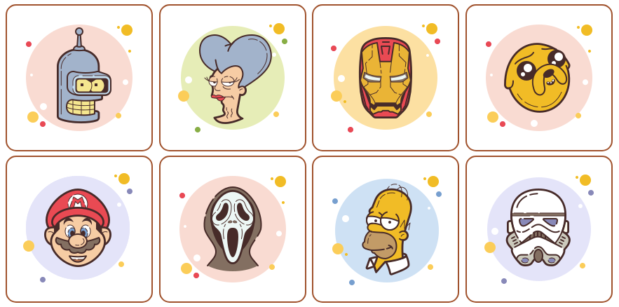
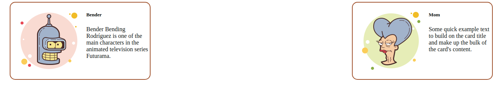

# Multi - DOM


В этом задании тебе нужно будет отрисовать все карточки с героями при помощи DOM. Внимательно ознакомься со структурой проекта,который лежит в папке `cartoon-project`. 

В файле `index.js` ты найдешь переменную ``` database ```, которая имитирует базу данных. В ней уже указано все, что тебе понадобится для дальнейшей работы. 

Перед тем как бросаться в бой, обдумай как ты будешь строить свою работу. Возможно ты захочешь использовать метод `createElement`, а может тебе будет удобно работать с [`cloneNode`](https://www.w3schools.com/jsref/met_node_clonenode.asp) и дальнейшей заменой определенных узлов [`childNodes`](https://www.w3schools.com/jsref/prop_node_childnodes.asp)

##  Release 0
#### Добавление одной карточки

Пока у нас есть только две карточки,в данном релизе нет задачи отрисовать сразу все, пусть твоим первым шагом будет отображение карточки железного человека ``` database[0] ```.

##  Release 1
#### Отрисовка всех карточек

Молодец! Железный человек на месте. 

Двигайся дальше, у нас ведь не один герой. Какие у тебя варианты? Написать код, где ты будешь обращаться отдельно к каждому элементу в стиле ``` clone.childNodes[1].src = hero[0].path ```

Но ведь программисты еще те ленивцы 😉
Поэтому давай подумаем, что мы можем сделать с массивом, чтобы не обращаться "механически" к его элементам, а автоматизировать процесс.
То есть тебе нужно сделать подобные манипуляции со всеми элементами массива ``` database ```.

## _Дополнительные Ссылки_:

- >[Document Object Model](https://developer.mozilla.org/ru/docs/DOM/DOM_Reference/%D0%92%D0%B2%D0%B5%D0%B4%D0%B5%D0%BD%D0%B8%D0%B5) Веб-документация MDN
- >[Работа с DOM](https://www.w3schools.com/js/js_htmldom.asp) w3Schools
